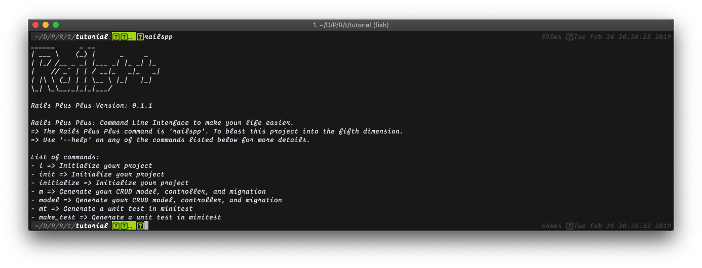

# Rails++

Autogenerate your CRUD operations with Swagger like API documentation without extra configuration 
and generate mini test unit tests.

## Requirements

- Rails version >= 5
- Ruby version >= 2.5

## Installation

In your gem file

```ruby
gem 'railspp'
```

In your terminal

```bash
gem isntall railspp
```

## CLI Commands

Your command CLI command bin path is `railspp`



## Getting Started

For existing project use Git and keep all the
changes from the initialize method while keeping your changes as well.

Example:
Create a new project and then initialize.

```bash
rails new (project-name)
cd (project-name)
#  Install dependency in gem file and globally
railspp init
```

Run the initialize command to get started:

```bash
railspp init
```

Run the model command to generate a migration, model, and completed controller:

This controller is overwritable when you declare the same method name in it's controller class.

```bash
railspp model (model-name)
```

Update your migration and model file. Then declare your routes with `resources`.
The controller has all api resources completed by default. These will fail if your migration and
model are not completed. And your routes are not defined.

Steps to do after:

- Update model file
- Update migration file
- Define your routes with resources

Run the make_test command to make unit tests:

```bash
railspp make_test (resource-route-name)
```

After your tests are completed. Update your update and create request bodies
based on the controller's `params.permit`. Add the keys available to your request body.
If you have special headers like "Authorization" add those to the public
variable `@headers` in that file.

Steps to do after:

- Update request body based on the controller's permitted keys
- Update your headers for all the requests

```bash

```

## API Documentation

There are Swagger-like API Documentation that requires no configuration.
This was created on your initialize command. This docs with regenerate the javascript
on API route changes.

The API documentation lives on your web route '/documentation'
Run the server and listen to url:

`http://localhost:3000/documentation`

For more information on the API docs check out the details here: [Autogenerated API Documentation Docs](./docs/API_DOCUMENTATION.md)

## Gloabl Controller

All of your CRUD operations were created in the GlobalController.
The GlobalController gets your model based on the class name of the controller.
Do not change the class name of the generated controller.

All methods are overwritable but have the functionality complete by default.
Restrict the routes you want accessible through the apiResource declaration.
Update the tests for ignoring the routes that do not exist.

By Default these methods are created:

- index
- show
- store
- update
- destroy

There are many querystrings available in the index method.
These contain options like:

- include=(associated model names comma separated)
- where=(key:value rows comma separated and key value pairs are semi-colon separated)
- order=(key:(DESC||ASC) rows comma separated and key DESC/ASC pairs semi-colon separated)
- limit=(amount returned the default is 25)
- offset=(number_to_skip in rows)
- page=(which page the default is 1)

For more information about the Global Controller check out the details here: [Global Controller Docs](./docs/GLOBAL_CONTROLLER.md)

## Unit tests

By default the tests check the format of the response and the status code.
You must provide request params for your store method and update method based
on the params options in your model. They are at the top of the file with TODOS.
There are tests for the querystrings. That you can update. The include
querystring test must be updated based on your schema.

The tests cover all querystrings with the same successful data format as default index currently.

Test cover:

Index:

- status_code = 200

Show:

- status_code = 200

Create:

- status_code = 201

Update:

- status_code = 200

Destroy:

- status_code = 204

For more information about the Unit Tests check out the details here: [Generated Unit Test Docs](./docs/RAILSUNIT.md)
